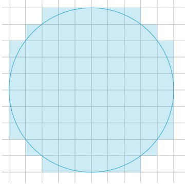
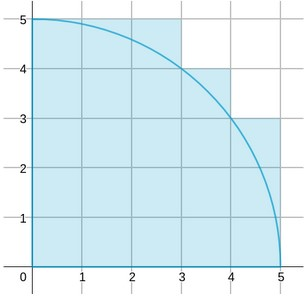

# Pixxels in circle

### Introduction

Suppose we want to draw a filled circle of radius r on a 2D monitor, how many pixels will be filled?

We fill a pixel when any part of the circle overlaps with the pixel. We also assume that the circle center is at the boundary of 4 pixels.
For example, 88 pixels are filled when r=5.

### Equation

$pixels(r) = 4 \times \sum_{x=0}^{r-1} \left\lceil \sqrt{r^2 - x^2} \space\right\rceil$

### Example: r=5

$pixels(5) = 4 \left( \left\lceil \sqrt{25 - 0} \space\right\rceil + \left\lceil \sqrt{25 - 1} \space\right\rceil + \left\lceil \sqrt{25 - 4} \space\right\rceil + \left\lceil \sqrt{25 - 9} \space\right\rceil + \left\lceil \sqrt{25 - 16} \space\right\rceil \space\right)
$

### Spec

- Parallelize the calculation using MPI.
- Program input format: srun -Nnode -nproc ./lab1 r k
    - node: number of nodes
    - proc: number of MPI processes
    - r: the radius of circle, integer
    - k: integer
- Program output: pixels % k (Since the output pixels may be very large, we output the remainder instead.)
- Your program should be at least (n/2) times faster than the sequential version when running with n processes. For example, when running with 12 processes, your execution time should not exceed 1/6 of the sequential code.

